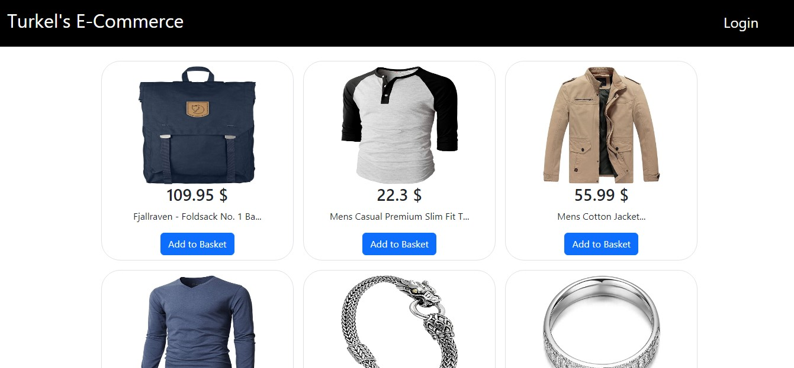
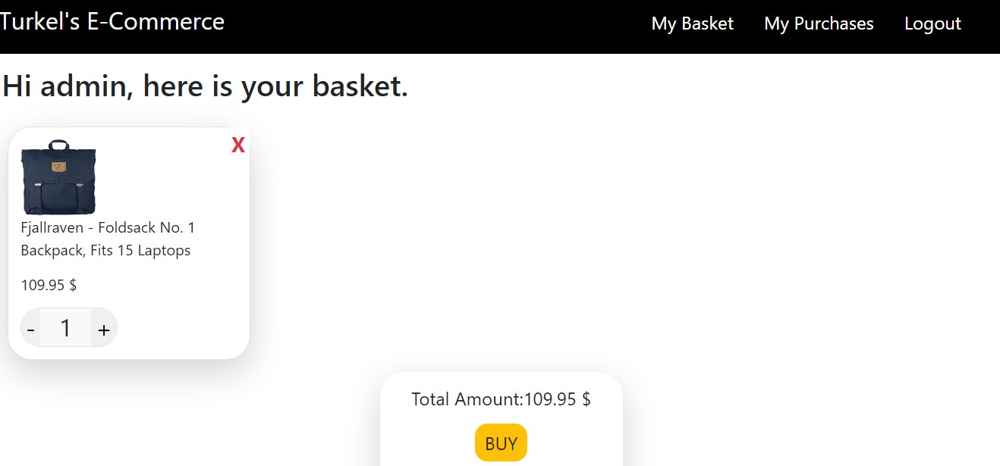
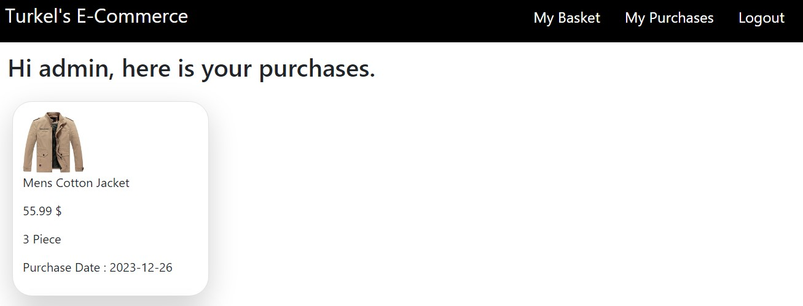

# E-commerce-next Frontend

E-commerce-app is a fullstack project that you can see products and you can add product to your basket and buy products. When you buy products you can see them in your purchases. To see the backend repo you can visit [E-commerce Backend](https://github.com/Hasan-Turkel/e-commerce-backend)  

## [Click to see live link.](https://turkels-ecommerce-next.vercel.app/)

## This is how the site looks like.

